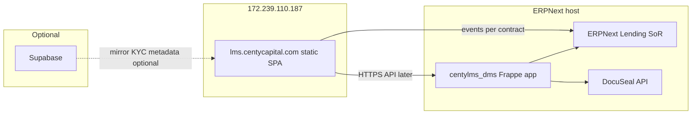

# CentyLMS Document Vault (`centylms_dms`) — Implementation Plan (Updated)

**Version:** 1.1  
**Status:** Planning — aligned with current production layout  
**Spec reference:** CentyLMS Document Vault v1.0 (full requirements document)

This plan updates the original phased spec now that the **runtime layout** is clear:

| Layer | What it is | Where it lives (production) |
|--------|------------|------------------------------|
| **LMS UI (static)** | HTML/CSS/JS console + CentyCred shell; mock or future API-backed data | **172.239.110.187** — `lms.centycapital.com` → `/home/lms.centycapital.com/public_html` (CyberPanel / OpenLiteSpeed). Deploy: [`deploy_lms.sh`](../deploy_lms.sh) rsync. |
| **ERPNext Lending** | Source of record (SoR) for lending lifecycle, companies, core loan entities | **erp.tarakilishicloud.com** (same infrastructure family; bench/site on ERP host — *exact bench path confirmed during Phase 0*). |
| **Document Vault** | Frappe custom app `centylms_dms`: DocTypes, private files, DocuSeal, permissions | **Installed on the ERPNext site** via `bench`, **not** under `lms.centycapital.com/public_html`. |
| **Supabase** (optional mirror) | Tenant-scoped read model / portal auth — see [`SUPABASE_MIGRATION_*.sql`](../SUPABASE_MIGRATION_001.sql) | Project `cxabhucaixwfyxvwlgdn`; [`MIGRATION_RUNBOOK.md`](../MIGRATION_RUNBOOK.md). |

**Important:** The static LMS repo does **not** contain Frappe `hooks.py` or `doctype/` folders. The DMS is a **separate Frappe application** deployed to ERPNext. The LMS frontend will consume DMS only **after** whitelisted APIs (`document_vault.py`) and auth are wired.

---

## 1. Architecture (full view)

- **Authoritative documents:** Frappe `LMS *` DocTypes + **private** `File` attachments under controlled paths (per spec).
- **Signing:** DocuSeal (self-hosted) — submissions, webhooks, embed URLs served from Frappe methods.
- **LMS static site:** remains the staff/borrower UI shell until it calls real endpoints; no document storage on the static host for production.

---

## 2. Decisions locked by current setup

1. **Tenant boundary:** Continue to use **`Company`** (lender) + **`Borrower`** (and loan links) as in ERPNext; map to your spec’s `lender_company` / borrower scoping. Exact field names (**discovery**): see Phase 0.
2. **DMS code location:** New repo or monorepo folder (e.g. `frappe_apps/centylms_dms`) — **not** inside [`lms-console`](../) static tree. CI: install on staging bench, then production `bench migrate`.
3. **KYC in Supabase vs Frappe:** For Document Vault v1, **Frappe holds file of record**. Supabase `kyc_documents` (if used) should either be deprecated for file truth or fed by **sync jobs** from Frappe to avoid two upload UIs fighting. Prefer **single upload path** (Frappe) for v1.
4. **Integration contract:** Extend or complement [`ERPNEXT_EVENT_CONTRACT.md`](../ERPNEXT_EVENT_CONTRACT.md) with optional events such as `kyc_document_verified`, `loan_agreement_signed` for downstream automation (not required for MVP DMS storage).

---

## 3. Phase 0 — Discovery and mapping (prerequisite)

**Goal:** No implementation of DocTypes until ERPNext DocType names and links are verified on the live Lending site.

| Task | Output |
|------|--------|
| Identify bench path and site name for `erp.tarakilishicloud.com` | Runbook note |
| Export / list Lending-related DocTypes: borrower, application, loan, collateral | Spreadsheet or markdown mapping table |
| Confirm `Company` vs custom `Lender` | Field used for `lender_company` on all DMS DocTypes |
| Confirm how CentyCred output is stored (DocType / attachment) | Hook target for `integrations/centycred.py` |
| DocuSeal: base URL, API key storage (single site vs per-company) | `LMS DocuSeal Settings` design validation |
| Network: can `172.239.110.187` (LMS) call ERPNext HTTPS without CORS issues | CORS + CSRF plan for portal |

**Deliverable:** `docs/DMS_ERPNEXT_DOCTYPE_MAPPING.md` (create during Phase 0) with column: *spec name* → *actual ERPNext DocType + link fields*.

---

## 4. Phase 1 — Core Frappe app, DocTypes, storage, roles (Days 1–2)

Aligned with spec §10 Phase 1, with install target clarified:

- Scaffold **`centylms_dms`** on dev bench; install on **staging** ERP site first.
- Implement DocTypes (prefix `LMS ` as in spec): Document Type Master (+ **fixtures/seed** for all listed seeds), Document Template (+ merge child table), Borrower / Loan / Collateral / Lender documents, DocuSeal Signing Request.
- **Private files only**; normalize attach paths under `/private/files/centylms_dms/...` via `before_insert` or File hook where needed.
- **Roles:** create Custom Roles from spec §7; **User Permissions** on `Company` and `Borrower` as described.
- **Tests:** two companies, two borrowers — upload KYC as staff; prove borrower A cannot see borrower B’s files.

**Exit criteria:** CRUD + permissions + seed data; no DocuSeal yet.

---

## 5. Phase 2 — KYC completeness and approval gate (Day 3)

- Implement `check_kyc_completeness(borrower)` (server) and `lms_check_kyc_completeness` API.
- **Borrower** form: KYC completeness widget (HTML field or dashboard widget) — mandatory types checklist.
- **Loan Application** (or your approval DocType): `before_save` / workflow validation — block approve if mandatory KYC missing; **`System Manager` override** as per spec.

**Exit criteria:** Approve blocked with clear missing-doc list; override works.

---

## 6. Phase 3 — DocuSeal multi-party signing (Day 4)

- `LMS DocuSeal Settings` Single DocType; secrets in Password fields.
- `api/docuseal.py`: `initiate_loan_signing()` with submitters list (borrower → co-signer → lender officer), `submitters_order` preserved.
- `LMS DocuSeal Signing Request` audit rows; link back to Loan / Collateral documents.
- Template push / preview buttons on `LMS Document Template` (staff-only).

**Exit criteria:** One full happy path: template → loan document → sent → webhook → `signed_document_file` attached; declined path sets status.

---

## 7. Phase 4 — Loan lifecycle hooks and auto-filing (Day 5)

- `integrations/loan_lifecycle.py` + `centylms_dms/hooks.py` `doc_events` on **mapped** DocType names from Phase 0.
- Auto-create rows (disbursement letter, closure letter, repayment schedule PDF placeholder, CentyCred report attachment) per spec table.
- Idempotent creates (don’t duplicate on re-save) using naming or “existing open doc” checks.

**Exit criteria:** Disburse/close triggers create expected `LMS Loan Document` rows.

---

## 8. Phase 5 — Webhooks, notifications, expiry (Day 6)

- Whitelisted `POST` webhook handler; HMAC or secret validation using `docuseal_webhook_secret`.
- Email notifications per spec §9.
- Scheduled job: collateral insurance **60-day** rule; lender regulatory **60-day** default where applicable.

**Exit criteria:** Notifications sent in staging; cron jobs registered in `hooks.py` `scheduler_events`.

---

## 9. Phase 6 — Portal APIs and LMS UI integration (Days 7–8)

**Backend (Frappe):** Implement all methods in spec §6 (`lms_get_*`, `lms_upload_*`, `lms_get_document_download_url`, `lms_get_signing_embed_url`) with role checks and `borrower_can_view` filtering.

**Frontend (static LMS on 172.239.110.187):**

- Add configuration (e.g. `window.LMS_API_BASE` or build-time env) pointing to **ERPNext site origin** for API calls.
- Replace mock DMS/KYC sections with calls to whitelisted methods (session cookie or token — **decide in Phase 0**: Frappe session vs API key for portal).
- “My Documents”, signing banner, KYC upload — match spec §8.5.

**Exit criteria:** UAT with test borrower on staging ERP + staging LMS subdomain or hosts file.

---

## 10. Deployment checklist (DMS vs LMS)

| Artifact | Deploy mechanism |
|----------|------------------|
| Static LMS (`index.html`, `app.js`, …) | [`deploy_lms.sh`](../deploy_lms.sh) → `/home/lms.centycapital.com/public_html` |
| `centylms_dms` | `bench get-app` / private git; `bench install-app`; `bench migrate`; restart |
| DocuSeal | Already shared; configure URL + keys in `LMS DocuSeal Settings` |
| Supabase | Optional; only if keeping mirror — [`MIGRATION_RUNBOOK.md`](../MIGRATION_RUNBOOK.md) |

---

## 11. Out of scope (unchanged)

Per spec §11: CRB automation, DPD demand letters, OCR, video KYC, external sharing, bulk migration, eCitizen — **post v1**.

---

## 12. References

- [`ERPNEXT_EVENT_CONTRACT.md`](../ERPNEXT_EVENT_CONTRACT.md) — SoR event patterns for lending.
- [`SPRINT1_IMPLEMENTATION_CHECKLIST.md`](../SPRINT1_IMPLEMENTATION_CHECKLIST.md) — Supabase + frontend refactor (parallel track; align KYC ownership with §2.3 above).
- [`README.md`](../README.md) — Static LMS deploy host and path.

---

*End of updated plan — v1.1*
